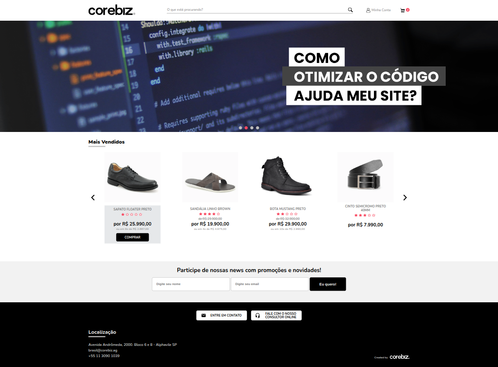

# Teste Prático de Front-End – Corebiz

## Demonstração visual dos resultados

### Desktop



### Mobile


## Objetivo:

Desenvolver uma aplicação web utilizando as tecnologias HTML5, CSS3 e JavaScript, com foco em React, seguindo as
melhores práticas do mercado. Este teste avalia não só a capacidade técnica do candidato, mas também sua
habilidade de criar um código limpo, escalável e bem documentado.

## Instruções Gerais:

<ul>
  <li>
    <b>Criação do Repositório:</b> Inicie um novo repositório Git e inclua um arquivo README.md com as instruções detalhadas necessárias para compilar testar e rodar o projeto.
  </li>
  <li>
    <b>Entrega:</b> Após a conclusão, envie o link do repositório para o e-mail do recrutador com o assunto “Teste Front-End”.
  </li>
  <li>
    <b>Prazos e Prioridades:</b> Não se preocupe se não conseguir completar todos os requisitos. Foque na qualidade e na implementação do que for possível dentro do tempo disponível.
  </li>
</ul>

### Comentário:

Esse é um repositório padrão de React com Typescript. Para poder rodar esse projeto basta clonar o repositório e rodar o comando:

```shell
npm run start
```

## Especificações Técnicas:

<ul>
  <li>
    <b>Tecnologias:</b> HTML5, CSS3 e JavaScript (React).
  </li>
  <li>
    <b>Responsividade:</b> O layout deve ser completamente responsivo, funcionando em diversos tamanhos de tela e dispositivos.
  </li>
  <li>
    <b>Acessibilidade:</b> Implementar práticas de acessibilidade para garantir que a aplicação seja utilizável por todos, incluindo pessoas com deficiências.
  </li>
</ul>

### Comentário:

As tecnologias utilizadas por esse projeto incluem as exigidas pelo desafio (HTML, CSS, JavaScript/TypeScript e React). A responsividade e acessibilidade foi respeitada, seguindo as exigências pelo design do Figma o mais fielmente possível, dentro do prazo estimado.

## Desafio:

Desenvolva uma página web baseada no layout e nas APIs fornecidas. A página deve ser responsiva, acessível e otimizada para performance.

## Requisitos Funcionais:

Desenvolva uma página web baseada no layout e nas APIs fornecidas. A página deve ser responsiva, acessível e otimizada para performance.

<b>Vitrine de produtos</b>

<ul>
  <li>
    <b>Integração com API:</b> Utilize a API de produtos para listar os itens na vitrine.
  </li>
  <li>
    <b>Detalhes de Implementação:</b> 
    <ul>
      <li>A vitrine deve exibir o nome, imagem e preço dos produtos.</li>
      <li>Utilize bibliotecas como Axios, Fetch API ou XMLHttpRequest para realizar as requisições.</li>
      <li><b>Desafio Adicional:</b> Implemente lazy loading para as imagens dos produtos para otimizar o carregamento.</li>
    </ul>
  </li>
  <li>
    <b>Carrinho de Compras:</b>
    <ul>
      <li>Ao clicar no botão “Comprar”, o item deve ser adicionado ao carrinho e a quantidade de itens no carrinho deve ser incrementada.</li>
      <li><b>Persistência:</b> A quantidade de produtos no carrinho deve ser preservada após a atualização da página. Utilize LocalStorage ou outra solução de armazenamento local para manter os dados.</li>
    </ul>
  </li>
</ul>

### Comentário:

Foi realizada a integração com a API de produtos devidamente para listar os produtos na vitrine principal.

A vitrine exibe o nome, imagem, preços dos produtos e demais detalhes disponíveis, como parcelamento e avaliações.

Foi utilizada a biblioteca Axios para fazer esse request.

Foi adicionado Lazy Loading nas imagens dos produtos.

Foi utilizada a ContextAPI para que ao clickar no botão de comprar fosse adicionado um produto no carrinho, enquanto ele exibe a quantidade de produtos que já foram adicionados.

Foi adicionada persistência utilizando o CartContext e localStorage.

Nos dispositivos desktop, foi adicionada a funcionalidade de hover para visualizar o botão comprar, seguindo o exemplo do Design System.

<b>Formulário de Contato</b>

<ul>
  <li>
    <b>Validações:</b>
    <ul>
      <li>Implemente validações em tempo real no formulário de contato. Valide campos como e-mail, nome e outros, conforme necessário.</li>
    </ul>
  </li>
  <li>
    <b>Envio de Formulário:</b> 
    <ul>
      <li>Após a validação, o formulário deve ser enviado via JavaScript para a API de newsletter. Certifique-se de seguir as especificações da API rigorosamente.</li>
    </ul>
  </li>
  <li>
    <b>Feedback ao Usuário:</b>
    <ul>
      <li>Informe o usuário sobre o sucesso ou falha no envio do formulário de maneira clara e acessível.</li>
    </ul>
  </li>
</ul>

### Comentário:

No Formulário de Contato foi realizada uma implementação bem
completa do que deve ser realizado em um formulário.

Utilizando um custom hook useForm, são feitas validações de
input de usuário para cada campo do formulário, retornando
mensagens específicas para cada caso.

Como também gerenciamento do estado do formulário em cada
fase que o usuário interage com ele.

Ao fazer submit, ele faz corretamente a requisição POST,
à API disponibilizada. E ao concluir, exibe a mensagem de
sucesso pro usuário.

Cada um dos estados do Formulário de Contato seguem o Design
System disponibilizado.

## Critérios de Avaliação:

<ul>
  <li>
    <b>Semântica Web:</b> Uso correto de tags HTML5 e boas práticas de acessibilidade.
  </li>
  <li>
    <b>Organização:</b> Estrutura limpa e modular, uso adequado de componentes e reutilização de código.
  </li>
  <li>
    <b>Lógica de Programação:</b> Implementação eficaz e eficiente das funcionalidades solicitadas.
  </li>
  <li>
    <b>Gerenciamento de Estado:</b> Uso apropriado de ferramentas como React hooks (useState, useEffect) ou context API para gerenciar o estado da aplicação.
  </li>
  <li>
    <b>Documentação:</b> Documentação clara e detalhada no README.md, explicando o processo de instalação, compilação e testes.
  </li>
  <li>
    <b>Automação de Tarefas:</b> Utilização de ferramentas como Webpack, Gulp ou Grunt para otimizar o build, minimizar arquivos CSS/JS, e outras automações.
  </li>
</ul>

### Comentário:

A semântica web foi bem respeitada, pois os testes de Lighthouse tanto para desktop como para mobile, deram acima de 90.

O código foi organizado utilizando boas práticas de Atomic Design, pois os componentes estão distribuídos em atoms, molecules e organisms, segundo a estrutura do site, como também o seu grau de responsabilidade e possibilidade de reutilização dentro do cenário apresentado.

A lógica de programação utiliza de boas práticas de SOLID, DRY e Clean Code para facilitar a sua manutenção como também a sua reutilização.

Para o gerenciamento de estado, foram usados React Hooks como useState, useEffect, useContext, useReducer como também custom hooks.

Para o gerenciamento de estado global do app, foi utilizada a ContextAPI.

Essa documentação é bem descritiva e faz comentários para cada um dos pontos apresentados no desafio.

Para gerar o build do código pode ser utilizado o comando npm run build como pode ser observado no package.json.

Mas não tem implementações de automação de tarefas significativas. Pois, trata-se de um projeto pequeno, ainda que poderia ser demonstrativo do conhecimento sobre
esse tipo de práticas.

## Bônus:

<ul>
  <li>
    <b>Testes Automatizados:</b> Implementação de testes unitários ou de integração utilizando bibliotecas como Jest, Testing Library ou Cypress.
  </li>
  <li>
    <b>Otimização de Performance:</b> Medidas tomadas para melhorar a performance da aplicação, como minificação de arquivos, compressão de imagens, e uso de cache.
  </li>
</ul>

### Comentário:

Não foram implementados testes automatizados, nem otimização de performance de uma forma direta. Poderia ter servido de exemplo de TDD ou de otimização de performance, ainda que com bons resultados segundo os resultados do Lighthouse, mas por causa do tempo, a performance não foi otimizada no seu ponto máximo, nem testes utilizando essas bibliotecas mencionadas.
